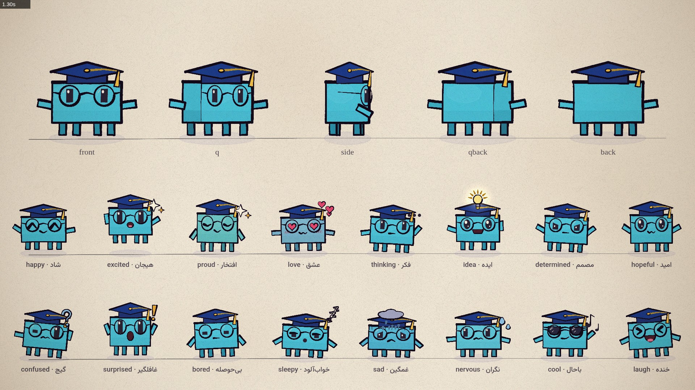

# کیت انیمیشن آموزشگاه فردا

«از امروز به فردا بیایید»

این مخزن یک کیت کوچک برای ساختن انیمیشن‌های کوتاهِ دست‌نقاشی‌شده با [p5.js](https://p5js.org) و [p5.brush](https://github.com/acamposuribe/p5.brush) است که برای **آموزشگاه فردا** (مؤسسه علمی آزاد فردا، بابلسر) شخصی‌سازی شده. نسخه‌ی اصلی‌اش [Claude Animation Base](README.en.md) است، بر اساس کد موزیک‌ویدیوی [I'm Upping My P(doom)](https://github.com/JohnHeibel/PDoomVideo). کد، دستورالعمل‌ها و کاراکترها طوری نوشته شده‌اند که یک مدل هوش مصنوعی (مثل Claude در Claude Code) بتواند با یک درخواست ساده یک ویدیوی کامل بسازد.



## چه چیزهایی شخصی‌سازی شده

- **فردی (Fardi):** کاراکتر تازه‌ی آموزشگاه. یک مکعب فیروزه‌ای با عینک گرد (معلم) و کلاه فارغ‌التحصیلی با منگوله‌ی طلایی (دانش‌آموز). همه‌ی ۳۱ احساس، پنج نمای کلیدی، دست‌ها و قلاب‌های Clawd را دارد. در [src/fardi.js](src/fardi.js).
- **هویت بصری سایت:** رنگ‌های تم کهکشانیِ سایت (آبی برند، فیروزه‌ای، نیلی، بنفش سحابی، سرمه‌ای عمیق) به پالت اضافه شده‌اند (`PAL.brand`، `PAL.cyan`، `PAL.cosmos`، `PAL.nebula`، `PAL.deep` و ...).
- **متن فارسی:** `letter()` حالا متن فارسی را خودکار راست‌به‌چپ و با فونت وزیرمتن (همان فونت سایت) می‌چیند، حروف را درست به هم می‌چسباند، و با `reveal` می‌تواند متن را از راست بنویسد. قانون «بدون متن» کیت اصلی به «متنِ کم و فارسی» تغییر کرده (راهنما، قانون ۲).
- **ویدیوی معرفی آموزشگاه:** «از امروز به فردا بیایید»، ۲۴ ثانیه، بر اساس مسیر رشد سایت: ۰۱ اندیشه تحلیلی ← ۰۲ یادگیری پروژه‌محور ← ۰۳ آمادگی برای آینده. کد در [src/scenes/farda_intro.js](src/scenes/farda_intro.js) و استوری‌بورد در [STORYBOARD.md](STORYBOARD.md).
- **هفت سبک نقاشی:** آبرنگ (پیش‌فرض)، گواش، مداد رنگی، فلت، کارتونی، کاغذ بریده و گچ روی تخته، با `style` در `src/config.js` ([src/styles.js](src/styles.js)). هر صحنه و کاراکتری در هر سبکی کشیده می‌شود.
- **رندر بدون کارت گرافیک:** حالت `--lite` (رنگ تخت به جای پرکردنِ آبرنگی) رندر را در WebGL نرم‌افزاری از حدود یک دقیقه به چند ثانیه برای هر فریم می‌رساند، و `--offline` بدون اینترنت کار می‌کند.
- **مستندات فارسی:** همین فایل و [ANIMATION_GUIDE.md](ANIMATION_GUIDE.md). نسخه‌های اصلی انگلیسی در [README.en.md](README.en.md) و [ANIMATION_GUIDE.en.md](ANIMATION_GUIDE.en.md) هستند.

## ساختن یک ویدیو

مخزن را کلون کن، در Claude Code (یا هر ایجنت کدنویسی دیگر) بازش کن و چیزی را که می‌خواهی بخواه:

> ANIMATION_GUIDE.md را بخوان، بعد یک ویدیوی ۱۵ ثانیه‌ای بساز که در آن فردی به یک دانش‌آموز کمک می‌کند قضیه‌ی فیثاغورس را کشف کند.

> ANIMATION_GUIDE.md را بخوان، بعد یک تیزر ۱۰ ثانیه‌ای برای دوره‌ی «انیمیشن‌سازی با هوش مصنوعی» بساز که آخرش نام دوره نوشته شود.

مدل اول استوری‌بورد می‌نویسد، شات به شات می‌سازد، برای بررسی کار خودش برگه‌های تماس رندر می‌کند و در آخر `out/video.mp4` را می‌نویسد. [ANIMATION_GUIDE.md](ANIMATION_GUIDE.md) قانون‌هایی را دارد که دنبال می‌کند: دست‌ساز، زنده، یک اثر واحد، متنِ کم، همیشه گذار، در هر صحنه یک اتفاق، و یک رسانه‌ی ثابت از ضربه‌های قلم‌مو، دوبعدیِ تخت و خط‌های جوشان. زمان‌بندی برای بیننده و اصول اصلی انیمیشن کاراکتر را هم پوشش می‌دهد.

چند پیشنهاد برای درخواست‌ها: از مدل بخواه قبل از کد استوری‌بورد را نشانت بدهد، گاهی دستورهای خیلی کلی بده و گاهی خیلی دقیق، از او بخواه احساس یا لباس تازه برای فردی بسازد، یا تصویر مرجع خودت را به او بده.

## اجرا روی سیستم خودت

به Node.js، Google Chrome و ffmpeg نیاز داری.

```bash
npm install
node render.mjs --clip --out=out/video.mp4
```

این دستور ویدیوی داستانی «از امروز به فردا بیایید» (۲ دقیقه و ۴۶ ثانیه؛ `src/scenes/story_*.js`، استوری‌بورد در [STORYBOARD_STORY.md](STORYBOARD_STORY.md)) را همراه آهنگش (`assets/music.m4a`) رندر می‌کند. برش‌ها و لحظه‌های داستان روی آهنگ چیده شده‌اند ([src/scenes/story_sync.js](src/scenes/story_sync.js))، و در `studio.html` دکمه‌ی ▶ (یا Space) ویدیو را با آهنگ پخش می‌کند. برای ویدیوی بی‌صدا `--audio=none` بده. برای ویدیوی معرفی ۲۴ ثانیه‌ای، در `studio.html` تگ‌های `story_*.js` را با `farda_intro.js` عوض کن و در `src/config.js` مقدار `duration` را `24` بگذار و `audio` را حذف کن. برای جلو و عقب بردن ویدیو، [studio.html](studio.html) را در Chrome باز کن. با `?loop=fardi` برگه‌ی مدل فردی، و با `?loop=emotions` یا `?loop=views` برگه‌های Clawd را می‌بینی. `?lite` حالت سبک را روشن می‌کند. اگر Chrome در جای استاندارد نیست، `--chrome=<مسیر>` بده یا `CHROME_PATH` را تنظیم کن.

**بدون کارت گرافیک:** پرکردن‌های آبرنگیِ p5.brush بدون GPU خیلی کندند. `--soft-gl --lite` اضافه کن:

```bash
node render.mjs --soft-gl --lite --offline --frames      # فریم‌ها در out/frames (قابل ادامه اگر قطع شد)
node render.mjs --encode --out=out/video.mp4             # ساختن MP4 از فریم‌ها
node render.mjs --encode --small --out=out/video_small.mp4   # کم‌حجم (۱۰۸۰p، حدود یک‌سوم)
node render.mjs --encode --tiny --out=out/video_tiny.mp4     # خیلی کم‌حجم (۷۲۰p، برای تلگرام و اینستاگرام)
node render.mjs --frames --reel --workers=4                # نسخه‌ی عمودی ۹:۱۶ برای ریلز (فریم‌ها در out/frames_reel)
node render.mjs --encode --reel --small --out=out/reel.mp4  # ساختن ریلز ۱۰۸۰×۱۹۲۰
```

در `--soft-gl` رندر با یک worker انجام می‌شود (چند worker در WebGL نرم‌افزاری فریم سیاه می‌دهند) و حدود ۸ ثانیه برای هر فریم طول می‌کشد، یعنی ویدیوی ۲۴ ثانیه‌ای حدود ۷۵ دقیقه. نسخه‌ی نهایی با کیفیت کامل را روی سیستمی با کارت گرافیک و بدون `--lite` رندر کن.

روی لینوکس، `render.mjs` کروم را با `--no-sandbox` اجرا می‌کند و Chromiumی را که Playwright نصب کرده هم پیدا می‌کند. روی سرور لینوکسی با کارت NVIDIA، `--gpu-angle=gl-egl` (یا `vulkan`) اضافه کن؛ `node gpu_probe.mjs <مسیر کروم>` نشان می‌دهد هر مجموعه پرچم کدام رندرکننده را می‌گیرد.

## چه چیزی کجاست

| مسیر | چیست |
|---|---|
| [ANIMATION_GUIDE.md](ANIMATION_GUIDE.md) | قانون‌ها، روند کار، هویت فردا و کل API. اول این را بخوان. |
| [STORYBOARD.md](STORYBOARD.md) | استوری‌بوردِ ویدیوی معرفی آموزشگاه |
| [src/fardi.js](src/fardi.js) | فردی، نماد آموزشگاه، و برگه‌ی مدلش |
| [src/clawd.js](src/clawd.js) | ریگ کاراکتر: نماها، احساس‌ها، چشم‌ها، دهان‌ها، کلاه‌ها، عینک، emoteها، رقص‌ها |
| [src/core.js](src/core.js) | نقاشی، پالت و رنگ‌های برند، زمان‌بندی، حرکت، دوربین، نور، کاغذ، متن فارسی، حالت lite |
| [src/timeline.js](src/timeline.js) | شات‌ها، حلقه‌ها و گذارِ براش‌وایپ |
| [src/config.js](src/config.js) | طول ویدیو و سرعت ضرب |
| [src/scenes/](src/scenes/) | ویدیوها: `farda_intro.js` (معرفی آموزشگاه) و `demo.js` (دموی کیت اصلی) |
| [render.mjs](render.mjs) | رندرکننده: برگه‌ی تماس، نوار فریم، برش، تصویر ثابت، MP4 |
| [docs/](docs/) | برگه‌های مدل: [فردی](docs/fardi.jpg)، [احساس‌های Clawd](docs/emotions.jpg) (و [متحرک](docs/emotions.webp))، [نماها، حرکت و کلاه‌ها](docs/views.jpg) |

## مجوز

MIT، مثل کیت اصلی ([LICENSE](LICENSE)).
